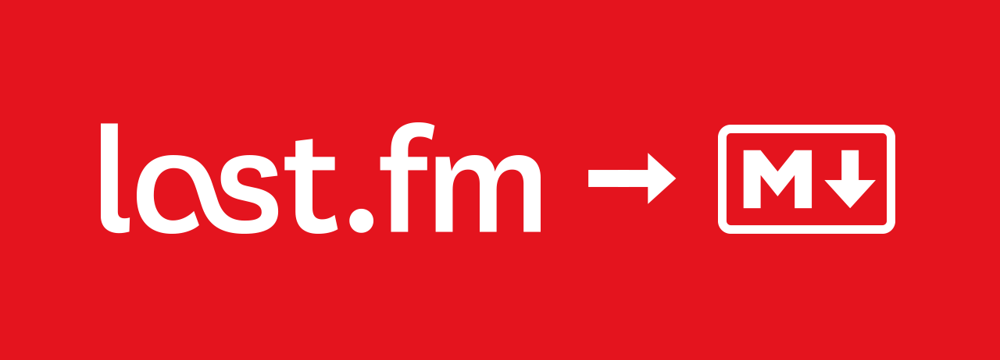

# last.fm to markdown



## 🤖 About this repo
This is a small project that I started because I wanted to have my last.fm weekly chart on my GitHub profile. I used GitHub Actions because they can be scheduled with cron jobs and you won't need to pass any sensitive information to modify the README.md file.

## 🎵 Example output, automatically updated every day
<!-- lastfm -->
<p align="center"><a href="https://www.last.fm/music/100+gecs/10,000+gecs"></a> <a href="https://www.last.fm/music/Tyler,+the+Creator/Wolf"></a> <a href="https://www.last.fm/music/Tyler,+the+Creator/Bastard"></a> <a href="https://www.last.fm/music/M.I.A./MATA"></a> <a href="https://www.last.fm/music/Tyler,+the+Creator/Cherry+Bomb"></a> <a href="https://www.last.fm/music/Molchat+Doma/%D1%8D%D1%82%D0%B0%D0%B6%D0%B8"></a> <a href="https://www.last.fm/music/Panic!+at+the+Disco/A+Fever+You+Can%27t+Sweat+Out"></a> <a href="https://www.last.fm/music/The+Cure/Three+Imaginary+Boys"></a> <a href="https://www.last.fm/music/The+Cure/The+Head+on+the+Door"></a> <a href="https://www.last.fm/music/M.I.A./MAYA"></a> </p>

          
## 👩🏽‍💻 What you'll need
* A README.md file.
* Last.fm API key
  * Fill [this form](https://www.last.fm/api/account/create) to instantly get one. Requires a last.fm account.
* Set up a GitHub Secret called ```LASTFM_API_KEY``` with the value given by last.fm.
* Also set up a ```LASTFM_USER``` GitHub Secret with the user you'll get the weekly charts for.
* Add a ```<!-- lastfm -->``` tag in your README.md file, with two blank lines below it. The album covers will be placed here.

## Instructions
To use this release, add a ```lastfm.yml``` workflow file to the ```.github/workflows``` folder in your repository with the following code:
```diff
name: lastfm-to-markdown

on:
  schedule:
    - cron: '2 0 * * *'
  workflow_dispatch:

jobs:
  lastfm:
    runs-on: ubuntu-latest
    steps:
      - uses: actions/checkout@v2
      - name: lastfm to markdown
        uses: melipass/lastfm-to-markdown@v1.3.1
        with:
          LASTFM_API_KEY: ${{ secrets.LASTFM_API_KEY }}
          LASTFM_USER: ${{ secrets.LASTFM_USER }}
#         INCLUDE_LINK: true # Optional. Defaults is false. If you want to include the link to the album page, set this to true.
#         IMAGE_COUNT: 6 # Optional. Defaults to 10. Feel free to remove this line if you want.
      - name: commit changes
        continue-on-error: true
        run: |
          git config --local user.email "action@github.com"
          git config --local user.name "GitHub Action"
          git add -A
          git commit -m "Updated last.fm's weekly chart" -a

      - name: push changes
        continue-on-error: true
        uses: ad-m/github-push-action@v0.6.0
        with:
          github_token: ${{ secrets.GITHUB_TOKEN }}\
          branch: main
```
The cron job is scheduled to run once a day because Last.fm's API updates weekly chart data daily at 00:00, it's useless to make more than 1 request per day because you'll get the same information back every time. You can manually run the workflow in case Last.fm's API was down at the time, going to the Actions tab in your repository.

## 🚧 To do
* Allow users to choose the image size for the album covers.
* Feel free to open an issue or send a pull request for anything you believe would be useful.
